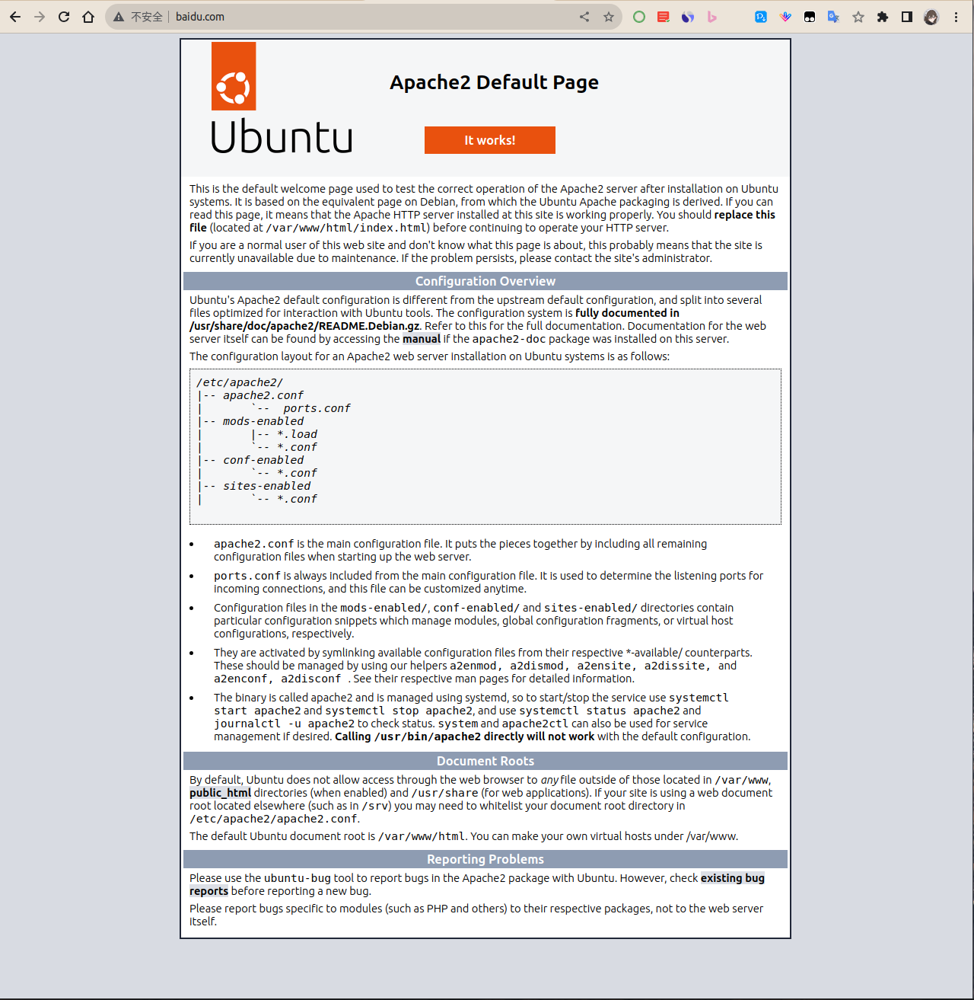
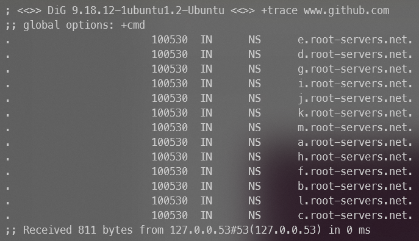
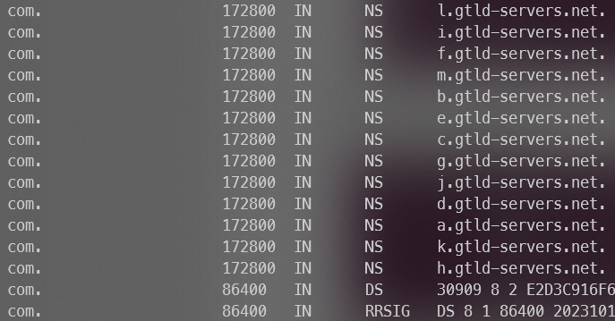
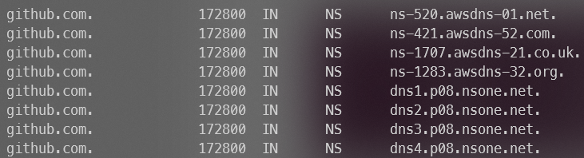
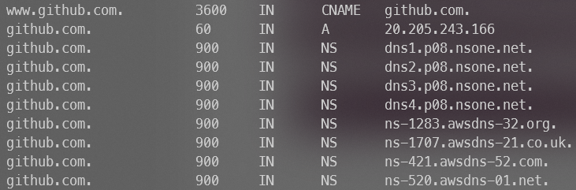
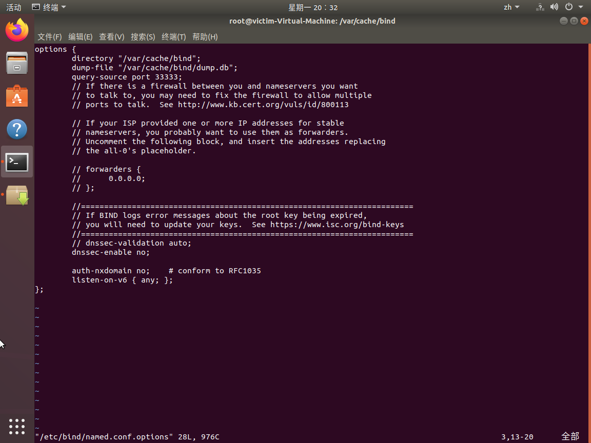
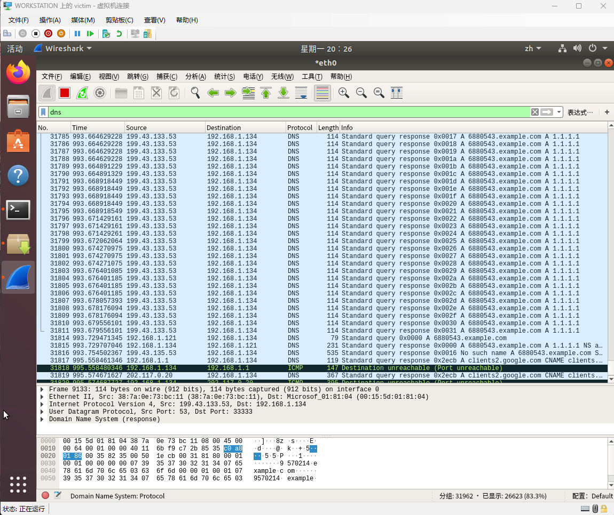

# 实验1 hosts & DNS

## 1.了解hosts文件

实验过程:

修改hosts文件:

修改结果:

**注意**: 指导书中重启网络命令`etc/init.d/networking restart`无效, 需要执行`sudo systemctl restart systemd-resolved`

## 2.dig+trace域名解析

实验过程:

dig查询GitHub:

dig +trace查询GitHub:

dig +trace步骤解析:

1. 先查询根域名服务器, 得到顶级域名服务器地址
    
2. 然后查询com.服务器, 得到github.com服务器地址
    
3. 接着查询github.com服务器, 得到www.github.com地址
    
4. 最后得到www.github.com地址
    

## 3.DNS投毒实验

实验过程:

**注意**: 本实验要求Ubuntu系统版本低于20, 此处采用18.04版本

1. 配置bind9服务器
    
2. 将投毒脚本中的目标IP地址修改为受害者的IP地址
3. 安装依赖包
4. 以`sudo`权限运行投毒脚本
    
    此时用wireshark观察受害者, 可以发现多起DNS通信
    
5. 观察受害者dns缓存, 发现已经被污染
    

## 4.投毒程序解释

1. 入口函数为`start_poison()`. 在这个函数中, 首先将IP地址按`.`分割以找到目标域名的上级权威服务器
2. 然后调用`Get_target_IP_list()`函数获取域名对应的IP地址列表
3. 在`Get_target_IP_list()`中, 构造并发送DNS查询请求, 对于获得的IP结果, 调用`ipv4_addr_check()`检验是否为IPv4, 如果是则添加到返回列表中
4. 在`ipv4_addr_check()`中, 使用正则表达式验证IP是否符合IPv4规定
5. 回到`start_poison()`中, 接下来进行无限循环投毒, 直到投毒成功后退出
6. 在循环体中, 首先生成随机数.example.com域名, 然后开辟一个线程用于像受害DNS服务器发送域名解析请求
7. 线程中, 调用`fake_q()`函数构造DNS解析请求并发送
8. 主进程等待线程结束, 然后调用`DNS_sending()`函数
9. 在`DNS_sending()`函数中, 构造错误的DNS响应报文, 并发送给DNS服务器
10. 然后调用`DNS_QR()`函数, 获得目标域名的解析结果
11. 检验结果是否为污染IP, 如果成功, 则退出循环, 否则继续循环
12. **注意**: 源代码存在错误如下:
    1. `os`模块没有`exit()`方法, 应使用`sys.exit()`
    2. 先退出再`print("成功!!!!")`无效, 应该先打印后退出
