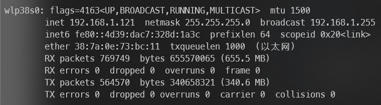
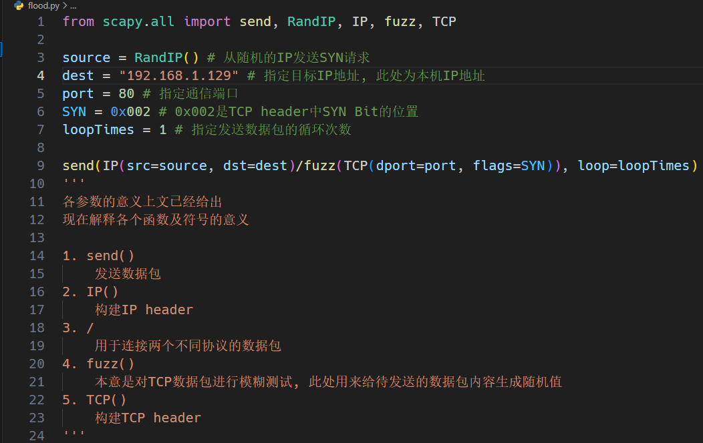
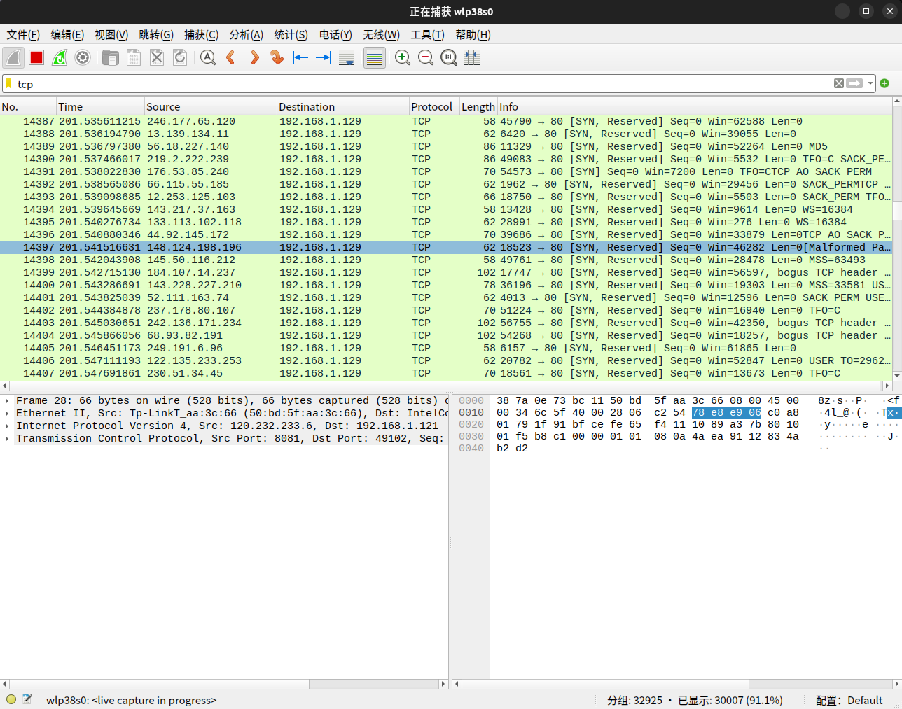
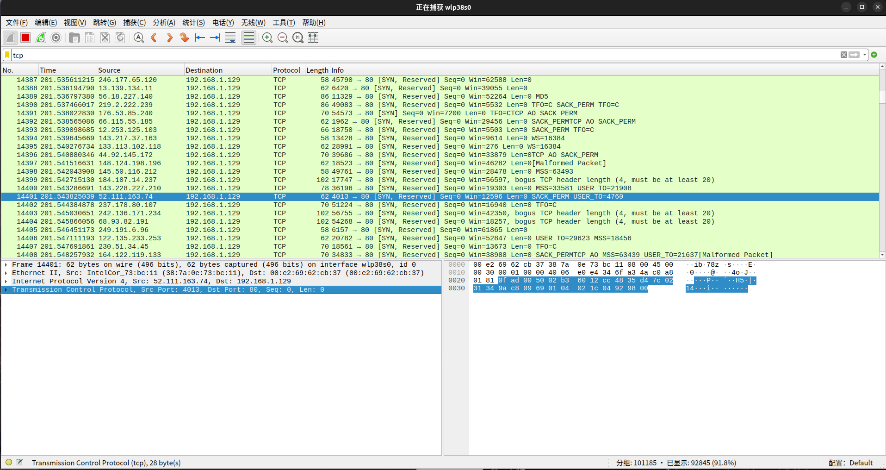
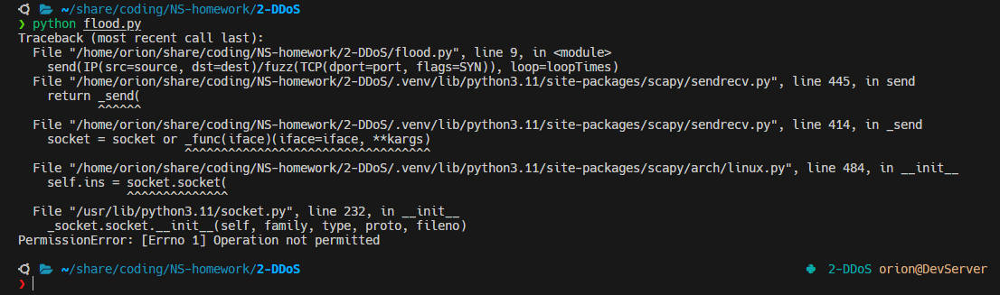

# 实验2 DDoS攻击

## 实验目的

1. 熟悉Linux系统, wireshark软件的基本操作
2. SYN洪泛攻击的实现与观察

## 实验原理

DDoS 攻击是通过连接互联网的计算机网络进行的。

这些网络由计算机和其他设备（例如 IoT 设备）组成，它们感染了恶意软件，从而被攻击者远程控制。这些个体设备称为机器人（或僵尸），一组机器人则称为僵尸网络。

一旦建立了僵尸网络，攻击者就可通过向每个机器人发送远程指令来发动攻击。

当僵尸网络将受害者的服务器或网络作为目标时，每个机器人会将请求发送到目标的 IP 地址，这可能导致服务器或网络不堪重负，从而造成对正常流量的拒绝服务。

由于每个机器人都是合法的互联网设备，因而可能很难区分攻击流量与正常流量。

## 实验步骤

1. 我自己有Linux服务器, 系统为Ubuntu23.04, 所以就不装虚拟机了
2. 我本来就配置好了apache服务器, 所以就不赘述了
3. SYN洪泛攻击
    1. 通过`ifconfig`命令获得服务器IP地址:
        
    2. 编写SYN洪泛攻击代码:
        
    3. wireshark抓包结果:
        
    4. wireshark拆包检查:
        
        参数解析:
        1. `Src Port`: 指明TCP数据包的发送端口
        2. `Dst Port`: 指明TCP数据包的接收端口
        3. `Seq`: 指明TCP数据包中第一个字节的序列号
        4. `Len`: 指明TCP数据包中数据的长度

## 遇到的问题和解决方法

我的服务器系统为Ubuntu23.04, 该版本不允许直接为python安装模块, 必须先创建虚拟环境, 然后在虚拟环境中运行`pip`安装模块

运行洪泛攻击脚本需要sudo权限, 否则会报错:

然而sudo运行的python是`/usr/bin/python`, 而不是虚拟环境中的python, 导致无法运行脚本

**解决方案**: 在运行`pip`命令时加入参数`--break-system-packages`强制安装或运行`sudo apt install python3-scapy`

## 小结

洪泛攻击的原理其实很简单, 我的疑问是这样随机生成的IP能被服务器追踪吗?

相较于DDoS, 我可能对渗透攻击更感兴趣一些
