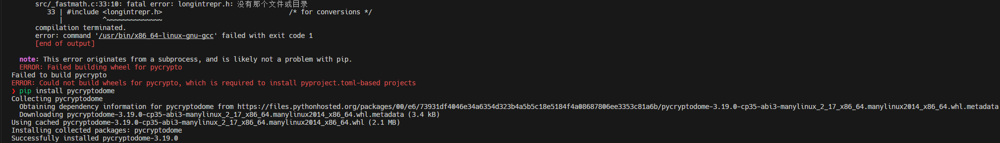
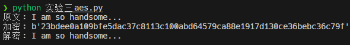
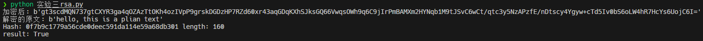
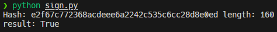
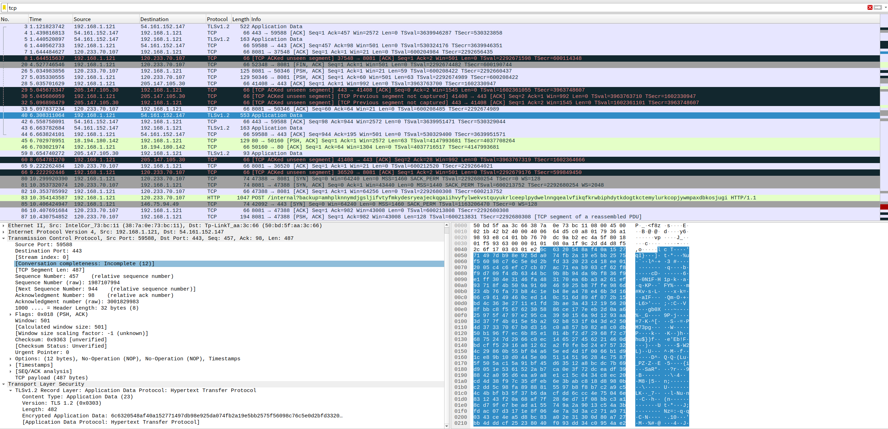

# 实验三 加解密

## 对称加密算法的字符串加解密

在Ubuntu23.10版本下, 执行`pip install pycrypto`报错:




运行`pip install pycryptodome`解决

代码运行结果:



## 使用RSA加解密

代码运行结果:



## 数字签名

编写代码如下:

```Python
import base64  # Import the base64 module for encoding and decoding data
from Crypto.Hash import SHA  # Import the SHA module from the Crypto library for hashing
from Crypto.Signature import PKCS1_v1_5 as Signature_pkcs1_v1_5  # Import the PKCS1_v1_5 module from the Crypto library for signing
from Crypto.PublicKey import RSA  # Import the RSA module from the Crypto library for working with RSA keys

n = b"This is a test string"  # Define a byte string to be hashed and signed

h = SHA.new()  # Create a new SHA hash object
h.update(n)  # Update the hash object with the byte string
print(f"Hash: {h.hexdigest()} length: {len(h.hexdigest())*4}")  # Print the hexadecimal digest of the hash and its length

sign_txt = "sign.txt"  # Define the name of the file to store the signature

with open("master-private.pem") as f:  # Open the private key file
    key = f.read()  # Read the contents of the file
    private_key = RSA.importKey(key)  # Import the private key from the file
    hash_obj = SHA.new(n)  # Create a new SHA hash object for signing
    signer = Signature_pkcs1_v1_5.new(private_key)  # Create a new signer object with the private key
    d = base64.b64encode(signer.sign(hash_obj))  # Sign the hash and encode it in base64

f = open(sign_txt, "wb")  # Open the signature file in binary write mode
f.write(d)  # Write the encoded signature to the file
f.close()  # Close the file

with open("master-private.pem") as f:  # Open the private key file again
    key = f.read()  # Read the contents of the file
    public_key = RSA.importKey(key)  # Import the public key from the file
    sign_file = open(sign_txt, "r")  # Open the signature file in read mode
    sign = base64.b64decode(sign_file.read())  # Read and decode the signature from the file
    h = SHA.new(n)  # Create a new SHA hash object for verification
    verifier = Signature_pkcs1_v1_5.new(public_key)  # Create a new verifier object with the public key
    print(f"result: {verifier.verify(h, sign)}")  # Verify the signature and print the result
```

运行结果如下:



## 抓包观察SSL协议通信握手过程

值得注意的是, TLS是SSL的直接后继者, 由于SSL协议握手步骤明显多于TLS, 故SSL已经被弃用. 现在术语SSL常用于指代TLS

为了避免浏览器缓存干扰, 在命令行执行`curl google.com -v`后观察wireshark输出:



可以看到, 成功抓取到了包含TLS的数据包

## 思考题

1. 在AES加密中`iv`变量的作用: `iv`是初始化向量Initialization Vector的缩写. 在密码学中, 初始化向量（IV）是一个随机或伪随机的值, 与密钥一起使用特定的加密算法（如AES的CBC模式）来加密数据. IV用于引入随机性并防止加密数据中出现模. 在加密过程中, 它与明文的第一个数据块进行异或操作, 然后与后续的每个数据块进行异或操作. 这样即使使用相同的密钥多次加密相同的明文, 得到的密文也会不同. 在代码中, 变量iv被设置为固定值b'qqqqqqqqqqqqqqqq'. 需要注意的是, 在实际应用中, IV应该是每次加密操作都是唯一且不可预测的, 以确保加密数据的安全性. 使用固定的IV, 如此示例中的代码, 可能会削弱加密的安全性. 要生成安全的IV, 可以使用密码学随机数生成器或编程语言或密码库提供的安全随机函数
2. RSA算法中, 公钥加密和私钥解密以及私钥加密和公钥解密是不同的. 在RSA算法中, 公钥用于加密数据, 私钥用于解密数据. 当使用公钥加密时, 只有私钥持有者才能解密该数据. 这种方式通常用于保护数据的机密性, 确保只有私钥持有者能够解密和访问数据. 相反, 私钥加密和公钥解密是一种数字签名的应用. 私钥持有者使用私钥对数据进行加密, 然后将加密后的数据和公钥一起发送给接收者. 接收者使用公钥对加密数据进行解密, 以验证数据的完整性和真实性. 这种方式通常用于验证数据的来源和确保数据的完整性
3. 注释已经在实验报告上文中给出, 要使得`result=False`, 只需要在第二次打开私钥文件时改变字符串`n`的值即可
4. SSL协议握手过程:
    1. 客户端向服务器发送握手请求: 握手开始时, 客户端向服务器发送一个握手请求, 其中包含支持的SSL/TLS版本、加密算法和其他参数.
    2. 服务器回应握手请求: 服务器收到客户端的握手请求后, 会回应一个握手响应.服务器的响应包含服务器选择的SSL/TLS版本、加密算法和其他参数.
    3. 客户端验证服务器证书: 在握手过程中, 服务器会向客户端发送其数字证书, 证书中包含了服务器的公钥.客户端会验证服务器证书的有效性, 包括验证证书的签名、有效期和颁发机构等.
    4. 客户端生成随机数和密钥: 客户端生成一个随机数作为会话密钥的一部分, 并使用服务器的公钥加密这个随机数.客户端还生成一个预主密钥（pre-master secret）, 用于生成会话密钥.
    5. 客户端发送加密的预主密钥: 客户端将加密的预主密钥发送给服务器, 确保只有服务器能够解密.
    6. 服务器解密预主密钥: 服务器使用自己的私钥解密客户端发送的加密预主密钥, 得到预主密钥.
    7. 客户端和服务器生成会话密钥: 客户端和服务器使用预主密钥和其他随机数生成会话密钥.这个会话密钥将用于加密和解密通信数据.
    8. 客户端和服务器确认握手完成: 客户端和服务器互相发送握手完成的消息, 表示握手过程已经完成.
5. 心得体会: 在完成实验过程中, 我深入了解了非对称和对称加密算法, 散列函数以及相关的加密工具包和库函数. 这些知识让我对数据安全和加密技术有了更深入的理解
