# 实验四 Web安全

## 1 靶场搭建

- 下载[xampp](https://www.apachefriends.org/zh_cn/download.html)
- 解压xampp文件夹，执行安装程序
- 下载[DVWA](https://github.com/digininja/DVWA/blob/master/README.zh.md)
- 下载[Burp Suite](https://portswigger.net/burp/releases/professional-community-2023-10-3-6)

### 1.1 配置DVWA环境

1. 启动xampp: `sudo /opt/lampp/xampp start`
2. 配置数据库:
   1. 浏览器访问[127.0.0.1](http://127.0.0.1)
   2. 点击上方`phpMyAdmin`->左边控制栏`新建`->主页面上方`账户`->主页面中间`新增用户账户`
   3. 用户名=`dvwa` 主机名=`127.0.0.1` 密码=`dvwa`
   4. 权限全选, `require ssl`选择None
   5. 执行
3. 进入DVWA所在文件夹`/opt/lampp/htdocs/DVWA`, 执行命令`sudo cp config/config.inc.php.dist config/config.inc.php`
4. 将`config.inc.php`中相关字段修改为:

    ```php
    $_DVWA[ 'db_server' ] = '127.0.0.1';
    $_DVWA[ 'db_database' ] = 'dvwa';
    $_DVWA[ 'db_user' ] = 'dvwa';
    $_DVWA[ 'db_password' ] = 'dvwa';
    ```

5. 浏览器打开[127.0.0.1/DVWA](http://127.0.0.1/DVWA), 输入用户名`admin`, 密码`admin password now enjoy`, 进入初始化页面, 点击`Create/Reset Database`
6. 在新的页面中输入用户名`admin`, 密码`password`进入[DVWA](http://127.0.0.1/DVWA)
7. 选择`DVWA Security`标签, 将安全等级设置为Low

### 1.2 配置Burp Suite

命令行运行`./你下载的东西.sh`

### 1.3 配置ARP攻击工具

命令行运行`sudo apt install ettercap-common driftnet -y`

## 3 开始实验

将系统代理按照指导书所给进行设置

浏览器中访问[127.0.0.1/DVWA](http://127.0.0.1/DVWA), 并且在`Burp Suite`上开启intercept功能, 成功抓到一个包:

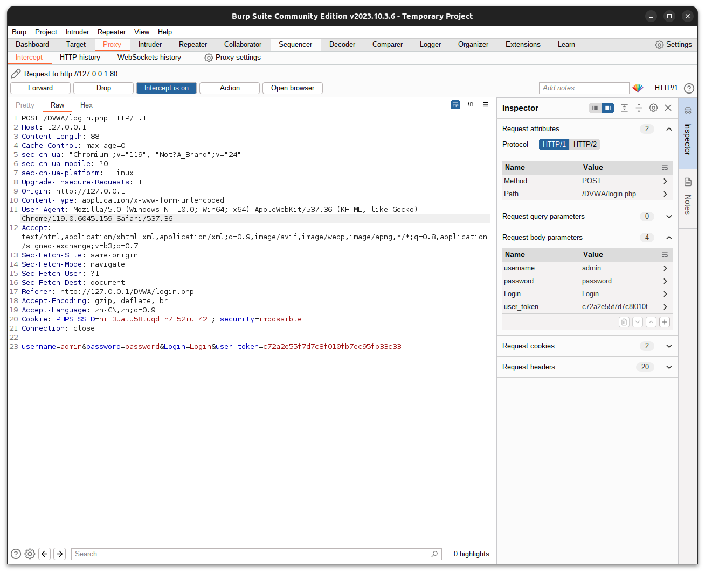

在登陆界面随意输入一个账号密码, 抓到了包:

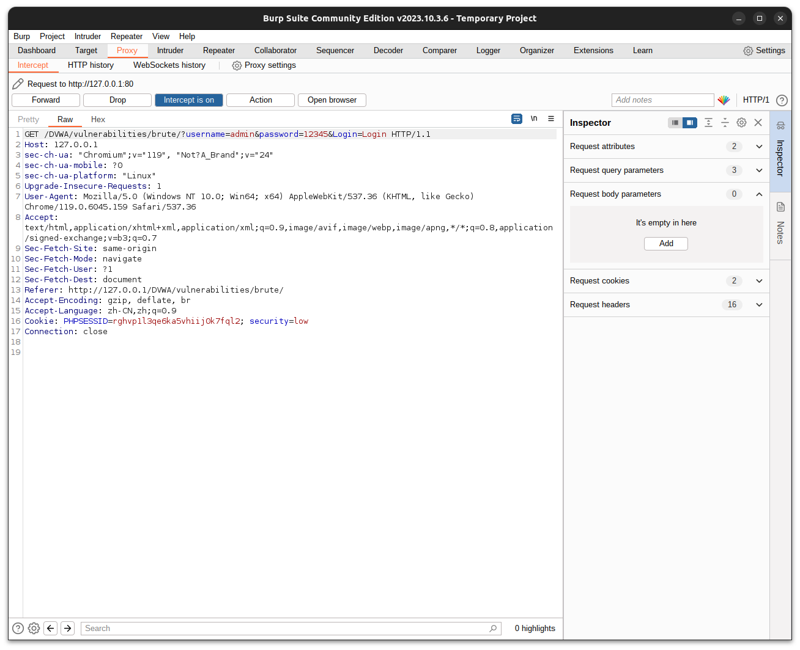

发送到intruder中, 标记密码参数:

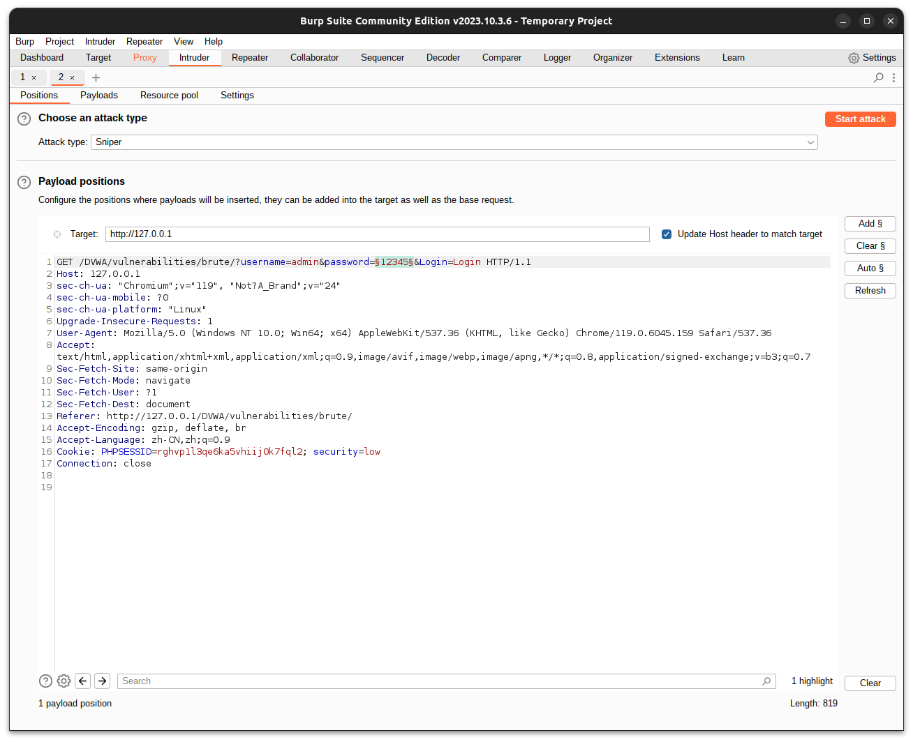

在`Payload settings [Simple list]`中加入字典:

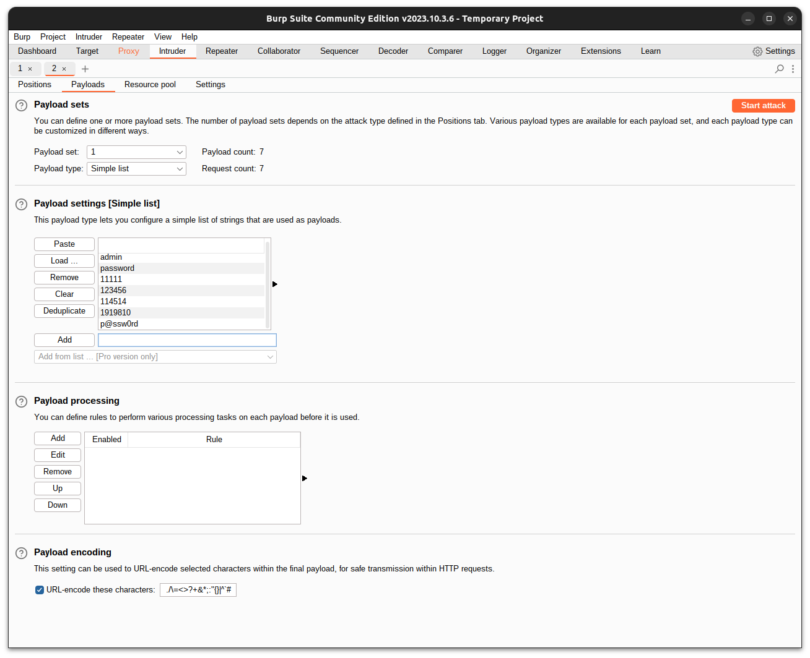

运行爆破攻击后成功:

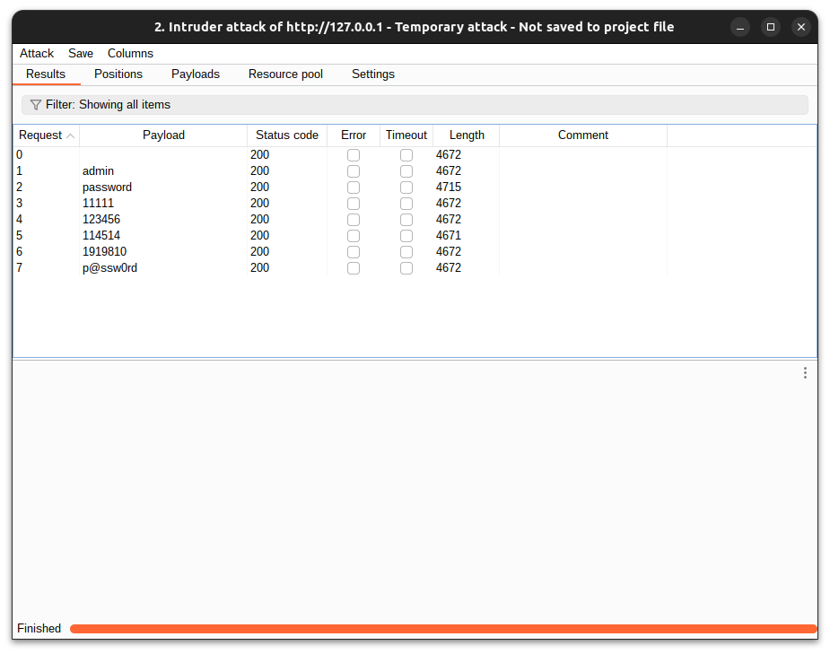

运行SQL注入成功:

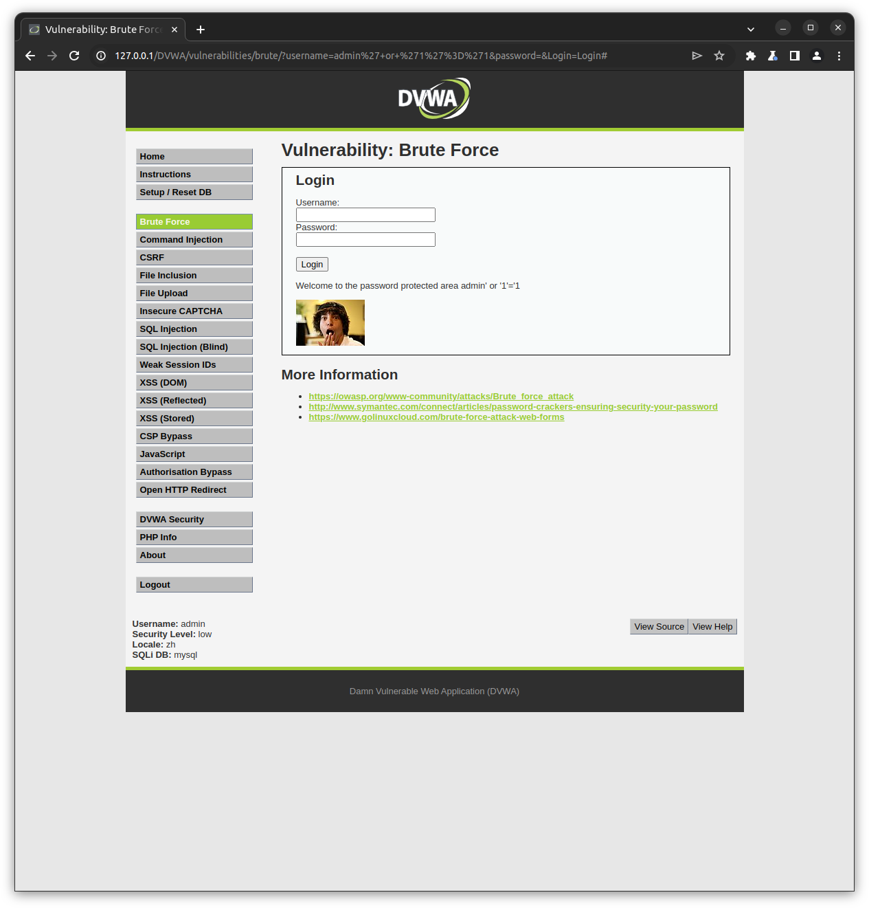

打开ettercap, 扫描本地的主机, 然后选择网关和同学的主机作为攻击对象:

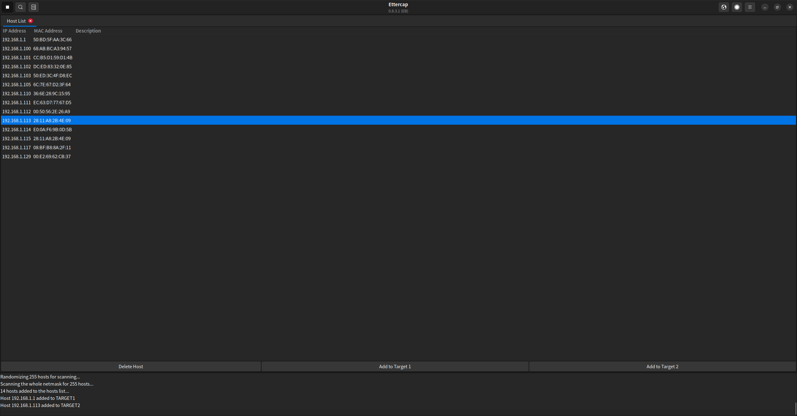

开始投毒:

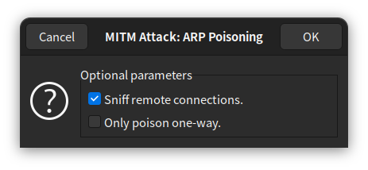

看到同学的主机上有本机的接口地址(`192.168.1.121`)

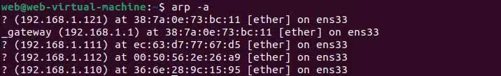

进行wireshark抓包:

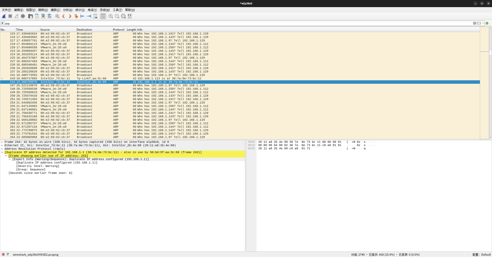

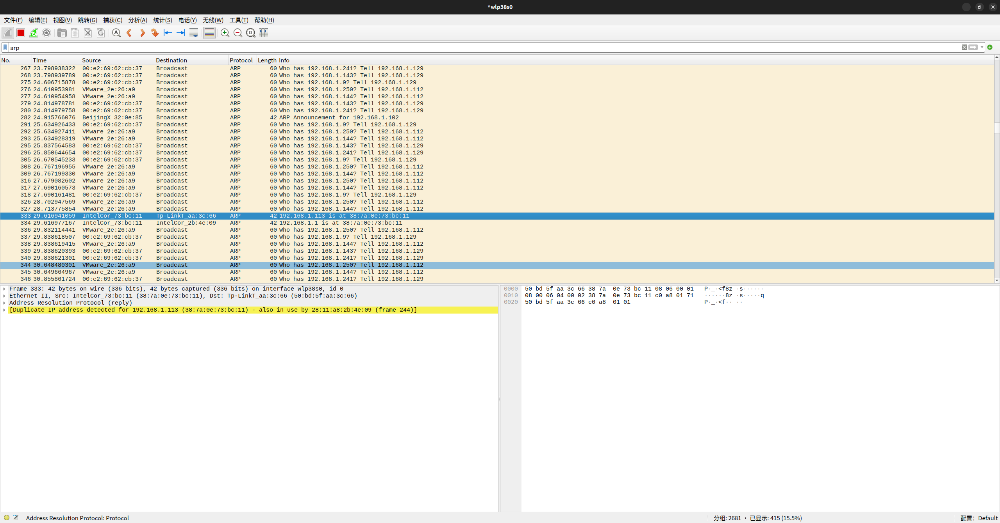

解释arp relpy报文:

1. 帧头（Frame Header）：包含源MAC地址和目标MAC地址，用于以太网帧的传输
2. 硬件类型（Hardware Type）：指定硬件地址的类型。例如，以太网的硬件类型为1
3. 协议类型（Protocol Type）：指定上层协议的类型。通常情况下，协议类型为IPv4，对应的值为0x0800
4. 硬件地址长度（Hardware Address Length）：指定硬件地址的长度，以字节为单位。对于以太网，硬件地址长度为6字节
5. 协议地址长度（Protocol Address Length）：指定协议地址的长度，以字节为单位。对于IPv4地址，协议地址长度为4字节
6. 操作码（Operation Code）：指定ARP操作的类型。ARP回复报文的操作码为2，表示回复
7. 发送方MAC地址（Sender MAC Address）：发送方（回复方）的MAC地址
8. 发送方IP地址（Sender IP Address）：发送方（回复方）的IP地址
9. 目标MAC地址（Target MAC Address）：目标（请求方）的MAC地址
10. 目标IP地址（Target IP Address）：目标（请求方）的IP地址

同学访问西交官网, 本机driftnet成功抓取图像:

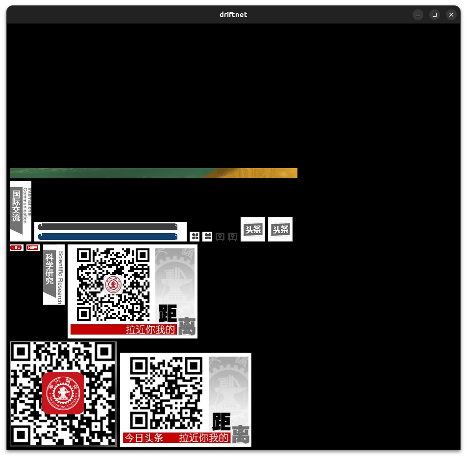

## 3 漏洞防御方法

一定要积极地更新系统和软件, 以获取最新的安全补丁和特性

### 3.1 防范暴力破解

1. 使用强密码策略, 要求用户使用长度, 复杂度, 随机性足够的密码
2. 使用多因素身份验证, 例如短信验证码, 生物识别, 硬件令牌等
3. 设置账户锁定机制, 当尝试登陆失败一定次数后锁定账户
4. 设置网络防火墙和入侵检测系统, 监控和过滤网络流量
5. 限制登陆权限, 例如只允许特定的可信IP登陆

### 3.2 防范SQL注入

1. 使用参数化查询, 确保恶意输入不被解释为SQL代码的一部分
2. 对输入进行验证和过滤, 使用输入验证的库或框架来检查输入的数据格式和类型, 并将注入字符转义或移除
3. 限制数据库用户权限, 不要使用root进行查询等操作
4. 不要将查询参数等信息暴露在URL中
5. 更进一步地, 使用对象关系映射(ORM)

### 3.3 防范ARP中间人攻击

1. 使用静态ARP表, 在网关, 服务器等关键设备上使用静态ARP表, 防止攻击方欺骗设备
2. 使用ARP欺骗检测工具, 识别ARP中间人攻击
3. 使用虚拟局域网(vLAN)将关键设备和其他网络隔离
4. 定期审查网络日志文件, 检测是否有异常ARP流量
